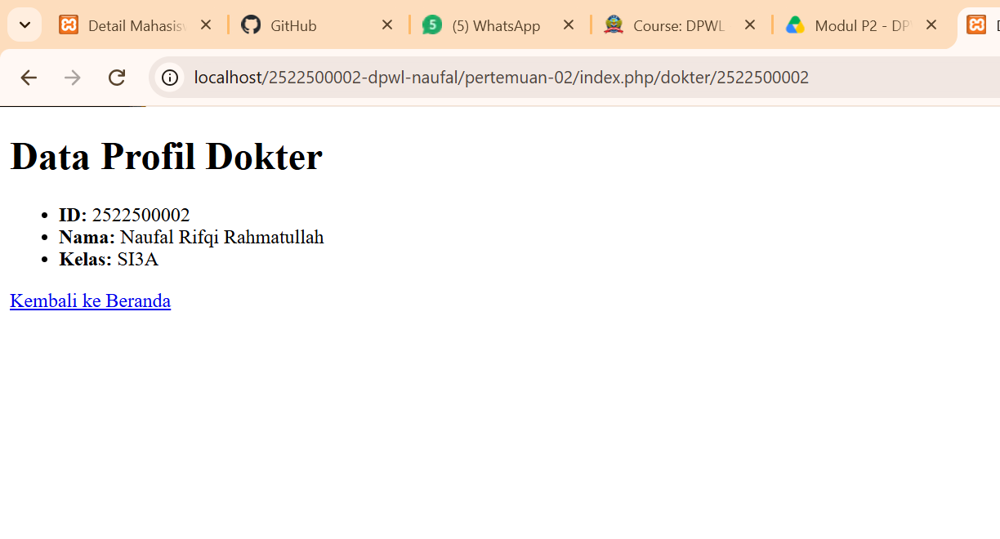
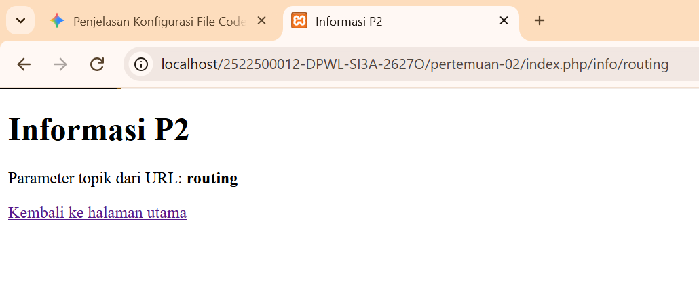
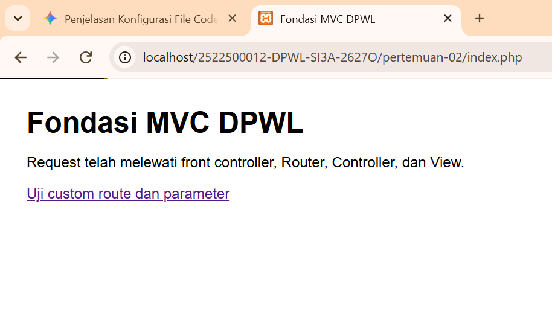

# pertemuan-02

## 1. Tujuan Praktikum
Memahami konsep dan alur kerja arsitektur PHP MVC kustom tanpa *framework*, serta mempraktikkan pengolahan *front controller*, pemetaan *routing*, dan penyajian data dinamis pada objek Dokter.


## 2. Struktur Direktori
```text
pertemuan-02/
├── application/
│   ├── config/          # Konfigurasi sistem (routes.php, config.php)
│   ├── controllers/     # Logika aplikasi (Home.php, Dokter.php)
│   ├── helpers/         # Helper fungsi (url_helper.php)
│   └── views/           # Tampilan antarmuka (home, dokter)
├── assets/
│   └── css/             # Berkas gaya (app.css)
├── dokumentasi/         # Tangkapan layar bukti uji (.jpg)
├── system/
│   └── core/            # Inti pemrosesan MVC (Controller.php, Router.php)
├── index.php            # Front Controller (pintu masuk utama)
└── README.md            # Dokumentasi laporan
```

3. Front Controller
index.php bertindak sebagai Front Controller, yaitu satu-satunya gerbang masuk untuk semua request URL. Berkas ini bertugas memuat konfigurasi sistem, memanggil Router, dan mengarahkan alur ke Controller yang sesuai.

## 4. Routing dan Pemetaan URL

| URL/Route | Controller | Method | Parameter | View |
|---|---|---|---|---|
| `/` | Home | index | - | home/index.php |
| `home/index` | Home | index | - | home/index.php |
| `home/info/mvc` | Home | info | mvc | home/info.php |
| `info/routing` | Home | info | routing | home/info.php |
| `dokter/1` | Dokter | index | 1 | dokter/index.php |

**Penjelasan Route Modifikasi (`dokter/1`):**  
Saat rute `dokter/1` diakses, *Router* mengarahkan *request* ke *Controller* `Dokter` pada *method* `index()`. Angka `1` dikirim sebagai parameter ID untuk menampilkan data spesifik dokter pada *View* `dokter/index.php`.

5. Base URL dan Helper
base_url(): Membentuk path absolut ke direktori utama untuk memuat aset statis.

Contoh: <link rel="stylesheet" href="<?= base_url('assets/css/app.css'); ?>">

site_url(): Membentuk URL lengkap aplikasi untuk navigasi rute Halaman.

Contoh: <a href="<?= site_url('info/routing'); ?>">Info Routing</a>

6. Alur Request-Response
Alur Eksisting P2:

Browser → index.php → Router → Controller → View → Response (Browser).

Posisi Model (MVC Utuh):

Browser → index.php → Router → Controller → Model → Database → Model → Controller → View → Response.

Catatan: Pada P2 komponen Model belum dipakai karena pemrosesan data basis data baru dimulai pada P3.

7. Hasil Pengujian dan Debugging
Skenario Valid: Mengakses /, info/routing, dan mahasiswa/1 berhasil menampilkan halaman web dan data yang sesuai.

Skenario Tidak Valid: Mengakses rute acak seperti home/xyz menghasilkan 404 Not Found.

Proses Debugging:

Gejala: Tampilan profil mahasiswa tidak diperbarui saat diuji di browser.

Penyebab: Perubahan kode pada VS Code belum tersimpan (unsaved).

Perbaikan: Menekan Ctrl + S pada seluruh berkas yang diedit.

Hasil Uji Ulang: Data profil mahasiswa berhasil diperbarui secara dinamis.

## jawaban no 8

Sisipkan gambar yang relevan dari folder dokumentasi/ dengan perintah:
### Gambar 1. Hasil Pengujian Halaman Utama

### Gambar 2. Hasil Pengujian Custom Route

### Gambar 3. Data Profil Pasien



9. Kesimpulan P2
Kerangka kerja PHP MVC kustom pada P2 telah berhasil mengelola front controller, pemetaan rute dinamis, serta pemisahan logika (Controller) dan tampilan (View). Integrasi pemrosesan basis data melalui Model akan diimplementasikan pada P3.